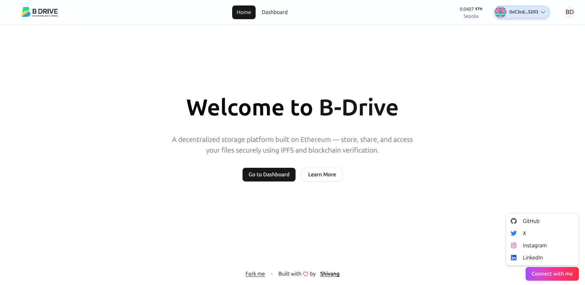

# B-Drive — Decentralized Cloud Storage on Web3

B-Drive is a decentralized storage application inspired by Google Drive — built for **ETHOnline 2025** using **Scaffold-ETH 2**, **Next.js**, and **IPFS/Lit Protocol**.  
It allows users to securely upload, view, and manage files using blockchain technology, ensuring **privacy, ownership, and censorship resistance**.

---

## 🧠 Overview

Traditional cloud storage systems rely on centralized servers that can be censored, hacked, or misused.  
**B-Drive** solves this by leveraging **IPFS** and **Ethereum smart contracts** to create a **fully decentralized, censorship-resistant storage platform**.

Every file is:

- Encrypted and uploaded to **IPFS** via **Lighthouse SDK**
- Linked to a user’s **Ethereum wallet address**
- Managed by a **smart contract** for ownership, tracking, and deletion
  This makes file management:

## Screenshots




> Transparent | Secure | Decentralized

- 🔒 **Decentralized File Storage** — Files are uploaded to IPFS (via Lighthouse SDK).
- 🧾 **Smart Contracts** — Manage file metadata, ownership, and permissions on Ethereum.
- 💡 **Wallet-Based Authentication** — Connect wallet using RainbowKit and WalletConnect.
- ⚙️ **Built with Scaffold-ETH 2** — Next.js + Hardhat + Wagmi + Viem.
- ☁️ **Deployed on Vercel** for a seamless Web2-like UX with Web3 power.

---

## 🏗️ Tech Stack

| Layer               | Technologies                                          |
| ------------------- | ----------------------------------------------------- |
| **Frontend**        | Next.js (TypeScript), Tailwind CSS, RainbowKit, Wagmi |
| **Smart Contracts** | Solidity, Hardhat, OpenZeppelin                       |
| **Storage**         | IPFS via Lighthouse SDK                               |
| **Infra**           | Scaffold-ETH 2, Vercel Deployment                     |
| **Blockchain**      | Sepolia Testnet                                       |

---

## ⚡ Getting Started

### 1️⃣ Clone the Repository

```bash
git clone https://github.com/Shivang14d04/b-drive.git
cd b-drive
```

### 2️⃣ Install Dependencies

```bash
yarn install
```

### 3️⃣ Start local blockchain (optional)

```bash
yarn chain
```

### 4️⃣ Deploy Smart Contracts

In a new terminal, run:

```bash
yarn deploy
```

### 5️⃣ Start the Development Server

```bash
yarn start
```

Open [http://localhost:3000](http://localhost:3000) to view the app in your browser.
